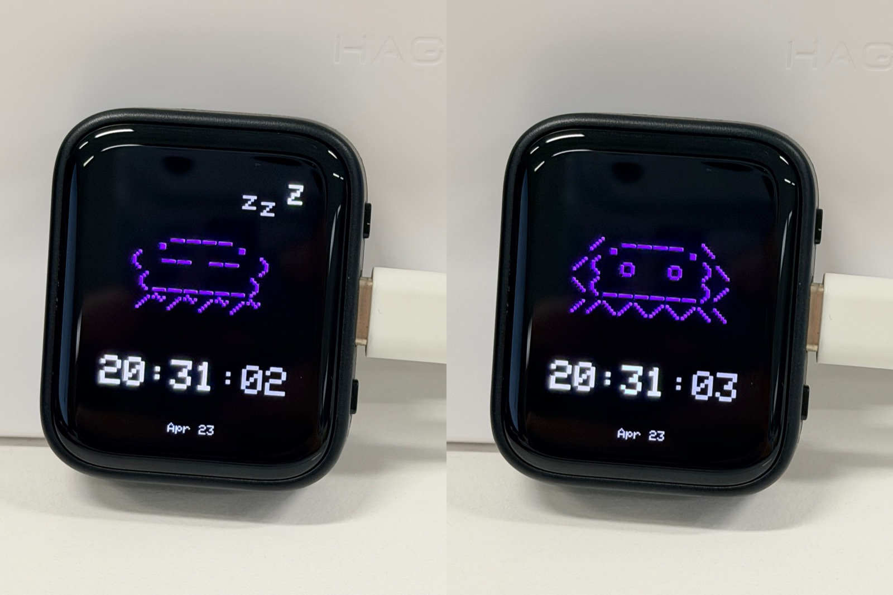

# claude-desktop-buddy

Claude for macOS and Windows can connect Claude Cowork and Claude Code to
maker devices over BLE, so developers and makers can build hardware that
displays permission prompts, recent messages, and other interactions. We've
been impressed by the creativity of the maker community around Claude -
providing a lightweight, opt-in API is our way of making it easier to build
fun little hardware devices that integrate with Claude.

> **Building your own device?** You don't need any of the code here. See
> **[REFERENCE.md](REFERENCE.md)** for the wire protocol: Nordic UART
> Service UUIDs, JSON schemas, and the folder push transport.

As an example, we built a desk pet on ESP32 that lives off permission
approvals and interaction with Claude. It sleeps when nothing's happening,
wakes when sessions start, gets visibly impatient when an approval prompt is
waiting, and lets you approve or deny right from the device.

<p align="center">
  
</p>

## Hardware

The firmware targets ESP32 with the Arduino framework. The current
PlatformIO environment in `platformio.ini` targets the Waveshare AMOLED 1.8
ESP32-S3 board (`waveshare-amoled-18`), and the pin/button mappings in
`src/main.cpp` follow that hardware.

For this board:

- `A` is the upper right-side button
- `B` is the lower right-side button
- the USB-C port sits between `A` and `B`

If you fork this to a different ESP32 board, update the pin, display, and
button mappings accordingly.

## Flashing

Install
[PlatformIO Core](https://docs.platformio.org/en/latest/core/installation/),
then:

```bash
pio run -t upload
```

If you're starting from a previously-flashed device, wipe it first:

```bash
pio run -t erase && pio run -t upload
```

Once running, you can also wipe everything from the device itself: **hold A
→ settings → reset → factory reset → tap twice**.

## Pairing

To pair your device with Claude, first enable developer mode (**Help →
Troubleshooting → Enable Developer Mode**). Then, open the Hardware Buddy
window in **Developer → Open Hardware Buddy…**, click **Connect**, and pick
your device from the list. macOS will prompt for Bluetooth permission on
first connect; grant it.

<p align="center">
  
  
</p>

Once paired, the bridge auto-reconnects whenever both sides are awake.

If discovery isn't finding the stick:

- Make sure it's awake (any button press)
- Check the stick's settings menu → bluetooth is on

## Controls

Current `waveshare-amoled-18` button layout:

- `A`: upper right-side button
- `B`: lower right-side button
- `USB-C`: between `A` and `B`

|                         | Normal               | Pet         | Info        | Approval    |
| ----------------------- | -------------------- | ----------- | ----------- | ----------- |
| **A** (upper right)     | next screen          | next screen | next screen | **approve** |
| **B** (lower right)     | scroll transcript    | next page   | next page   | **deny**    |
| **Hold A**              | menu                 | menu        | menu        | menu        |
| **Hold A + tap B**      | next ASCII pet       | next ASCII pet | next ASCII pet | —        |
| **Hold B (~6s)**        | hard power off       |             |             |             |
| **Shake**               | dizzy                |             |             | —           |
| **Face-down**           | nap (energy refills) |             |             |             |

The screen auto-powers-off after 30s of no interaction (kept on while an
approval prompt is up). Any button press wakes it.

## UI states

The firmware has three primary display modes plus several temporary overlays.

- `Normal`: the pet/character is shown with the Claude session HUD at the bottom.
- `Pet`: pet stats/help pages.
- `Info`: six info pages (`About`, `Buttons`, `Claude`, `Device`, `Bluetooth`, `Credits`).

Transient overlays and special states:

- `Approval`: replaces the HUD when Claude sends a permission prompt.
- `Menu`: top-level menu with `settings`, `turn off`, `help`, `about`, `demo`, `close`.
- `Settings`: `brightness`, `sound`, `bluetooth`, `wifi`, `led`, `transcript`, `ascii pet`, `reset`, `back`.
- `Reset`: `delete char`, `factory reset`, `back`. Destructive actions require a second confirm tap within 3 seconds.
- `Passkey`: shown during BLE pairing when a 6-digit passkey is requested.
- `Clock`: shown on USB power while idle, with a valid RTC and no overlays active.
- `Nap`: triggered by face-down detection; display dims until the device is turned face-up again.
- `Screen off`: triggered after 30s idle on battery power; any button wakes it.

Render priority is effectively:

- `Passkey`
- `Clock`
- `Info` or `Pet`
- `Normal` HUD
- then overlay one of `Reset`, `Settings`, or `Menu` on top when open

`Approval` is handled inside `Normal` and replaces the normal HUD contents.

## Button behavior by context

Physical buttons on the current `waveshare-amoled-18` board:

- `A`: upper right-side `BOOT` button
- `B`: lower right-side `PWR` button

Global/default behavior:

- `A` short press: cycle display mode `Normal -> Pet -> Info -> Normal`
- `A` long press (~600ms): open/close menu
- `B` long press (~6s): power off
- `Hold A + tap B`: switch to the next ASCII pet
- Shake: temporary `dizzy` animation
- Face-down: enter nap

Context-sensitive behavior:

- `Normal`: `B` scrolls the transcript/HUD backlog
- `Pet`: `B` changes page
- `Info`: `B` changes page
- `Menu`: `A` moves selection, `B` confirms
- `Settings`: `A` moves selection, `B` changes/applies the selected item
- `Reset`: `A` moves selection, `B` arms or confirms the selected reset action
- `Approval`: `A` approves, `B` denies
- `Screen off`: any button wakes the display; the wake tap is swallowed and does not trigger the normal action

## ASCII pets

Eighteen pets, each with seven animations (sleep, idle, busy, attention,
celebrate, dizzy, heart). Menu → "next pet" cycles them with a counter.
Choice persists to NVS.

## GIF pets

If you want a custom GIF character instead of an ASCII buddy, drag a
character pack folder onto the drop target in the Hardware Buddy window. The
app streams it over BLE and the stick switches to GIF mode live. **Settings
→ delete char** reverts to ASCII mode.

A character pack is a folder with `manifest.json` and 96px-wide GIFs:

```json
{
  "name": "bufo",
  "colors": {
    "body": "#6B8E23",
    "bg": "#000000",
    "text": "#FFFFFF",
    "textDim": "#808080",
    "ink": "#000000"
  },
  "states": {
    "sleep": "sleep.gif",
    "idle": ["idle_0.gif", "idle_1.gif", "idle_2.gif"],
    "busy": "busy.gif",
    "attention": "attention.gif",
    "celebrate": "celebrate.gif",
    "dizzy": "dizzy.gif",
    "heart": "heart.gif"
  }
}
```

State values can be a single filename or an array. Arrays rotate: each
loop-end advances to the next GIF, useful for an idle activity carousel so
the home screen doesn't loop one clip forever.

GIFs are 96px wide; height up to ~140px stays on a 135×240 portrait screen.
Crop tight to the character — transparent margins waste screen and shrink
the sprite. `tools/prep_character.py` handles the resize: feed it source
GIFs at any sizes and it produces a 96px-wide set where the character is the
same scale in every state.

The whole folder must fit under 1.8MB —
`gifsicle --lossy=80 -O3 --colors 64` typically cuts 40–60%.

See `characters/bufo/` for a working example.

If you're iterating on a character and would rather skip the BLE round-trip,
`tools/flash_character.py characters/bufo` stages it into `data/` and runs
`pio run -t uploadfs` directly over USB.

## ASCII preview tool

For local ASCII pet debugging, this repo includes a Chromium-only preview page:

```bash
python3 -m http.server 8000
```

Then open:

```text
http://localhost:8000/docs/preview.html
```

The preview tool can:

- drive the real device over Web Serial
- switch species and send a local-only forced persona state
- pull low-frequency USB screen snapshots into the same page so you can inspect
  the real board output without saving image files

The forced state command is intentionally repo-local and not part of
`REFERENCE.md`:

```json
{"cmd":"debug_state","state":"auto|sleep|idle|busy|attention|celebrate|dizzy|heart"}
```

Use `auto` to clear the override and return to the normal firmware-derived
state machine.

The preview page also supports a repo-local USB screenshot command:

```json
{"cmd":"screenshot"}
```

It streams the current 184×224 framebuffer back over USB in chunked `rgb332`
form for local debugging. This is intentionally outside the stable
`REFERENCE.md` contract.

For snapshot mode, prefer the page's higher USB baud options (`921600` by
default). The mirror remains low-frequency, but the higher link speed keeps the
refresh loop inside a practical debugging range.

## The seven states

| State       | Trigger                     | Feel                        |
| ----------- | --------------------------- | --------------------------- |
| `sleep`     | bridge not connected        | eyes closed, slow breathing |
| `idle`      | connected, nothing urgent   | blinking, looking around    |
| `busy`      | sessions actively running   | sweating, working           |
| `attention` | approval pending            | alert, **LED blinks**       |
| `celebrate` | level up (every 50K tokens) | confetti, bouncing          |
| `dizzy`     | you shook the stick         | spiral eyes, wobbling       |
| `heart`     | approved in under 5s        | floating hearts             |

## Project layout

```
src/
  main.cpp       — loop, state machine, UI screens
  buddy.cpp      — ASCII species dispatch + render helpers
  buddies/       — one file per species, seven anim functions each
  ble_bridge.cpp — Nordic UART service, line-buffered TX/RX
  character.cpp  — GIF decode + render
  data.h         — wire protocol, JSON parse
  xfer.h         — folder push receiver
  stats.h        — NVS-backed stats, settings, owner, species choice
characters/      — example GIF character packs
tools/           — generators and converters
```

## Availability

The BLE API is only available when the desktop apps are in developer mode
(**Help → Troubleshooting → Enable Developer Mode**). It's intended for
makers and developers and isn't an officially supported product feature.
